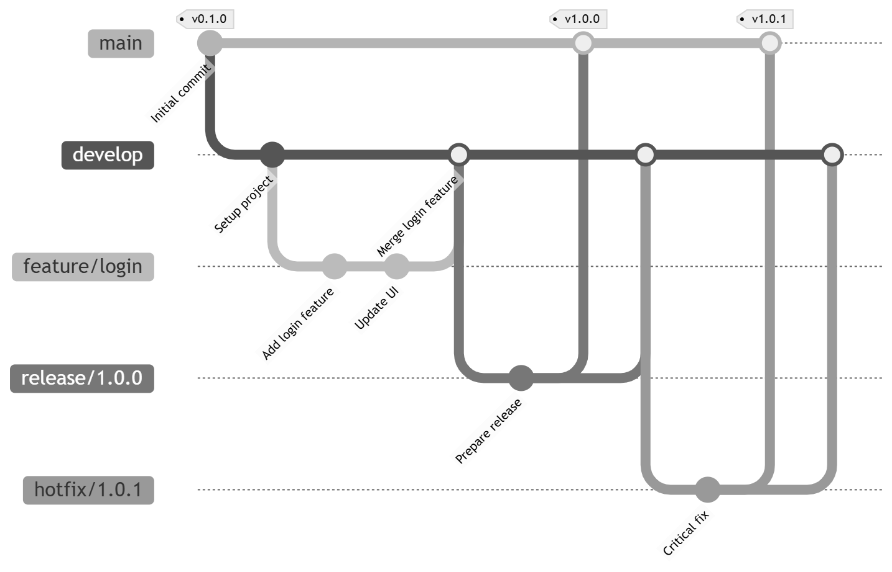

<h1 align="center">GitFlow Project</h1>

<p align="center">
  
  
  
</p>
 
 > Production-grade GitFlow implementation with automated CI, code quality enforcement, and comprehensive documentation.

---

### 📖 Table of Contents
 1. [Features](#Features)
 2. [Quick Start](#quick-start)
 3. [Documentation](#documentation)
 4. [Workflows](#workflows)
 5. [Contributing](#contributing)
 6. [License](#license)

## ✨ Features
- ✅ GitFlow branching strategy implementation
- ✅ Automated CI with GitHub Actions
- ✅ Pre-commit hooks for code quality
- ✅ Semantic versioning
- ✅ Automated testing pipeline
- ✅ Security scanning
- ✅ Comprehensive documentation

## 📈 GitFlow Diagram


## 🚀 Quick Start
```bash
# Clone repository
git clone https://github.com/munnavuyyuru/gitflow-project.git
cd gitflow-project

# Install hooks
./scripts/install-hooks.sh

# Install dependencies
npm install

# Run tests
npm test

# Start development server
npm start
```
## 📚 Documentation

-  [Workflow Guide](docs/WORKFLOW.md) – Complete GitFlow workflow  
-  [Troubleshooting](docs/TROUBLESHOOTING.md) – Common issues and solutions


## 🌊 Workflows
 ### 1. Feature Development
```Bash
git checkout develop
git checkout -b feature/my-feature

# Make changes
git commit -m "feat: add new feature"
git push origin feature/my-feature

# Create PR to develop
```
### 2. Release Process
```Bash
git checkout develop
git checkout -b release/1.2.0

# Update version and changelog
git push origin release/1.2.0

# PR to main → Tag → Merge back to develop
```
### 3. Hotfix
```Bash
git checkout main
git checkout -b hotfix/1.1.2-critical-fix

# Make fix
git push origin hotfix/1.1.2-critical-fix

# PR to main → Tag → Merge to develop
```


## 🤝 Contributing
 1. Read [WORKFLOW.md](docs/WORKFLOW.md)
 2. Create feature branch from develop
 3. Make changes and add tests
 4. Submit PR with filled template
 5. Wait for review and CI checks


## 📊 Project Stats
- Branch Protection: Enabled
- Required Reviews: 1
- CI : GitHub Actions
- Test Coverage: ~90%
- Documentation: Complete

## 🛠️ Tech Stack
- Runtime: Node.js
- CI: GitHub Actions
- Versioning: Semantic Versioning
- Strategy: GitFlow


## 📄 License
MIT License – see [LICENSE](LICENSE)

## Acknowledgments
 Built as a production-grade demonstration of GitFlow methodology for DevOps/DevSecOps learning.

